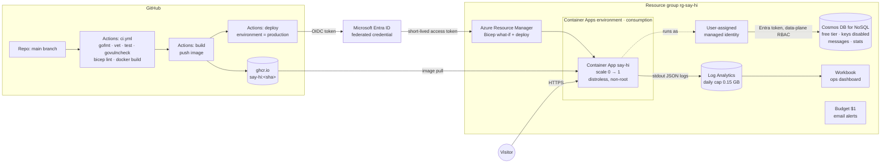

# say-hi on Azure: architecture

`say-hi` is a terminal-style portfolio written in Go (Fiber + HTMX). It runs
on Azure **entirely inside the free tier**, and the deployment is automated end to end:

- Infrastructure is code (Bicep).
- Deployments go through GitHub Actions and authenticate with OIDC, so there are no stored secrets.
- The app reaches its database through a managed identity, so there are no keys or connection strings.
- Every request produces a structured log line that can be queried with KQL.

Type `cloud` in the site's terminal to see the live revision, replica and region it is running on.

## Architecture

### Request flow
1. A visitor opens the site. Container Apps' Envoy ingress terminates TLS. If no replica is running (the app has scaled to zero), one is started. That's a cold start of roughly 2–5 s.
2. Fiber serves the HTML shell. On the first visit of the day, the visitor counter in Cosmos DB is incremented with a server-side *patch increment*, which is atomic across replicas.
3. Typed commands (`whoami`, `showcase`, `cloud`, `ping`, ...) are sent with HTMX `POST /command`. The server returns an HTML fragment that is swapped into the terminal.
4. `ping` renders a contact form. `POST /contact` goes through validation, a honeypot field and a per-IP rate limit, then the message is written to Cosmos DB.
5. Every request is logged as one JSON line on stdout. Container Apps ships it to Log Analytics, and the Workbook charts it.

## Services used

| Service | Role here | Doc |
|---|---|---|
| Azure Container Apps | Runs the container, HTTPS ingress, autoscaling to zero, revisions | [container-apps.md](azure/container-apps.md) |
| Azure Cosmos DB for NoSQL | Contact messages + visitor counter | [cosmos-db.md](azure/cosmos-db.md) |
| Managed Identity + Entra ID RBAC | App → database auth with no secrets | [managed-identity.md](azure/managed-identity.md) |
| Log Analytics + Workbooks | Centralised logs, KQL, dashboard | [log-analytics.md](azure/log-analytics.md) |
| Bicep / Azure Resource Manager | Infrastructure as code | [bicep.md](azure/bicep.md) |
| GitHub Actions + OIDC federation | CI/CD without stored credentials | [github-actions-oidc.md](azure/github-actions-oidc.md) |
| Cost Management budgets | Spend guardrail | [cost-management.md](azure/cost-management.md) |
| GitHub Container Registry | Image registry (and why not ACR) | [registry.md](azure/registry.md) |

See also:
- [skills.md](skills.md): skills shown, and where each appears in the repo.
- [deploy.md](deploy.md): how to bootstrap, deploy, add a custom domain and tear down.

## Cost

| Resource | Free allowance | Expected usage | Monthly cost |
|---|---|---|---|
| Container Apps (consumption) | 180k vCPU-s, 360k GiB-s, 2M requests/month | 0.25 vCPU only while serving traffic; scales to zero | $0 |
| Container Apps environment | No charge on the consumption plan | n/a | $0 |
| Cosmos DB free tier | 1000 RU/s + 25 GB, always free | 1000 RU/s shared (hard-capped by `totalThroughputLimit`) | $0 |
| Log Analytics | 5 GB ingestion/month, 31 days retention | < 0.15 GB/day (hard daily cap) | $0 |
| Managed identity, Workbook, budget, Entra app | Free | n/a | $0 |
| GitHub Actions + GHCR | Free for public repositories | n/a | $0 |

The budget alert emails at 50% and 100% of $1, so any unexpected charge shows up within a day.
